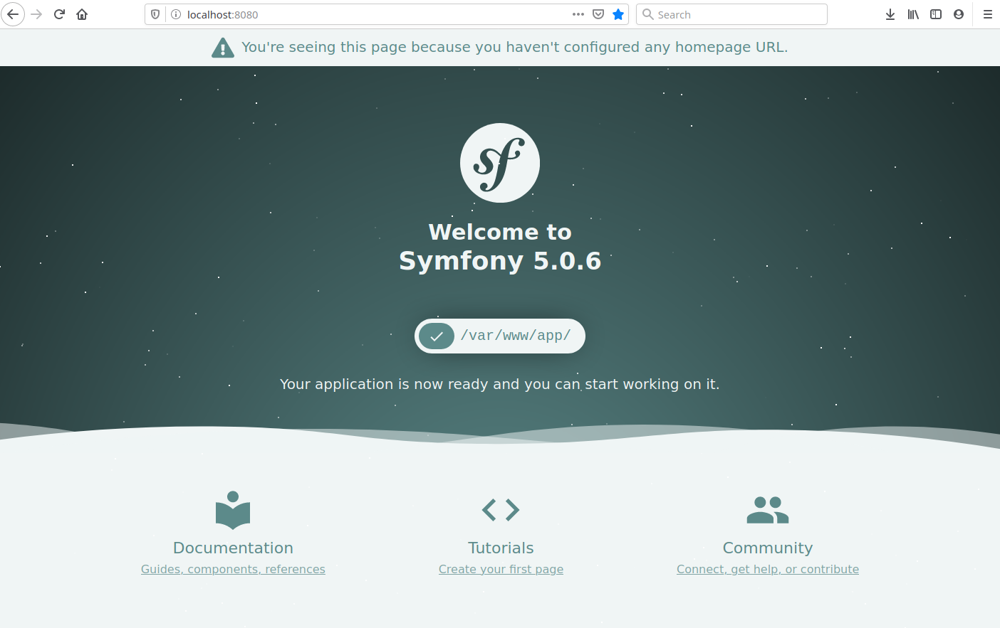

# dnpsp: docker-nginx-php-symfony-postgres development environment

## Goal
Our goal is to build a development environment with 3 containers:
- **nginx_server** (the `app-bundle/nginx` directory will persist data in your host machine)
- **postgres_server** (the `app-bundle/db` directory will persist data in your host machine)
- **php_server**

## Docker and Git installation in your host machine

Make sure you have `git`, `docker`, and `docker-compose` installed in your system. If you don't, please follow the instructions provided bellow:

- For **git**:

    [https://git-scm.com/downloads](https://git-scm.com/downloads)

- For **docker**:

    [https://docs.docker.com/install/](https://docs.docker.com/install/)

- For **docker-compose**:

    [https://docs.docker.com/compose/install/](https://docs.docker.com/compose/install/)

> **Note:** I assume that you can run both `docker` and `docker-compose` as a non-root user. In unix systems (ie: Linux, etc) you can use   `sudo usermod -aG docker your-user` to achieve that.

## Setting up your containers

1. Clone this repository using `git clone` to directory `app-bundle` and set it as the current directory:

    ```
    /your/path$ git clone https://github.com/rocharv/dnpsp.git app-bundle
    /your/path$ cd app-bundle
    /your/path/app-bundle$
    ```

2. Your directory structure will look like this now:

    ```
    /your/path/app-bundle$ tree
    .
    ├── app
    ├── docker
    │   ├── docker-compose.yml
    │   ├── nginx_service
    │   │   ├── Dockerfile
    │   │   └── nginx.env
    │   ├── php_service
    │   │   ├── composer-install.sh
    │   │   ├── Dockerfile
    │   │   ├── php.env
    │   │   ├── php.ini-development
    │   │   ├── php.ini-development-modified
    │   │   ├── php.ini-production
    │   │   ├── php.ini-production-modified
    │   │   └── xdebug.ini
    │   └── postgres_service
    │       ├── Dockerfile
    │       └── postgres.env
    ├── nginx
    │   └── default.conf
    ├── README.md
    └── symfony-skeleton.png
    ```

    > **Note:**
    The `app` directory (where your **Symfony** source code shall live) is used by `docker-compose.yml`, php_service's `Dockerfile` and nginx's `default.conf`. If you want to use another name, you should do it now and edit these files before next step. However, if you are not familiar with **docker** and configurations files, I recommend you postpone these changes until you see the whole environment working.

4. Now it's time to run your containers. Use `docker-compose` to launch it from `docker` directory:

    ```
    /your/path/app-bundle$ cd docker
    /your/path/app-bundle/docker$ docker-compose up --build -d
    ```

## Symfony's setup

You can create a new **Symfony** skeleton inside the `app` directory. We will also need to set **git** user's name and email.

If you don't have `composer` nor `symfony` installed in your host machine, you can execute `/bin/bash` from `php_server` container.

```
/your/path/app-bundle/docker$ docker exec -it php_server /bin/bash
root@850e7a0bd345:/var/www/app# git config --global user.name "User Name"
root@850e7a0bd345:/var/www/app# git config --global user.email "user@domain.com"
root@850e7a0bd345:/var/www/app# symfony new .
root@850e7a0bd345:/var/www/app# chmod -R 660 var/log/
```

> **Note 1:** Your hostname that represents `php_server` will be probably a different hash from mine (850e7a0bd345), don't worry about that.

> **Note 2:** You can leave the container by typying `exit` on its terminal.

Browsing [http://localhost:8080](http://localhost:8080) should result in:



## Shutting down

Tired of programming? Go grab a **Brazilian coffee** for yourself, it's good for you! But before doing that, shut down your **docker** containers:

```
/your/path/app-bundle/docker$ docker-compose down
```

## Last thoughts
I strongly recommend that you read/edit the `docker-compose.yml`, all `Dockerfiles` and `.env` files. Modifying them, customizing directories and settings is the only way forward.